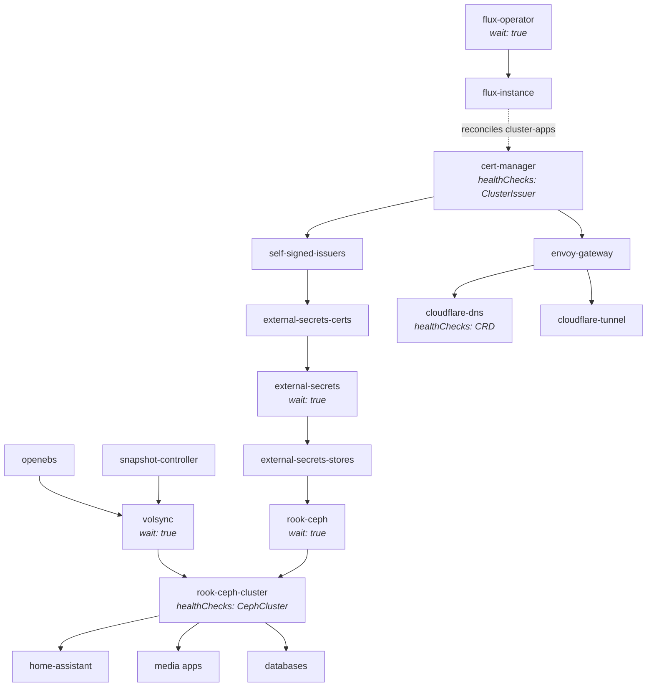

# Bootstrap Dependency Chain

This documents the Flux Kustomization dependency chain.
Apps will not reconcile until all their upstream dependencies report healthy.

## Dependency tree

## Boot order summary

| Phase | Kustomization | `wait` | Key health gate |
|-------|--------------|--------|-----------------|
| 1 | `flux-operator` | `true` | Operator pods ready |
| 2 | `flux-instance` | `false` | — |
| 3 | `cert-manager` | — | `ClusterIssuer` Ready via CEL expr |
| 3 | `openebs` | — | — |
| 3 | `snapshot-controller` | — | — |
| 4 | `self-signed-issuers` | — | — |
| 4 | `envoy-gateway` | `false` | — |
| 4 | `volsync` | `true` | Operator pods ready |
| 5 | `external-secrets-certs` | `false` | — |
| 5 | `cloudflare-dns` | — | HelmRelease + `dnsendpoints` CRD |
| 5 | `cloudflare-tunnel` | `false` | — |
| 6 | `external-secrets` | `true` | Webhook ready |
| 7 | `external-secrets-stores` | `false` | — |
| 8 | `rook-ceph` | `true` | Operator CRDs registered |
| 9 | `rook-ceph-cluster` | — | HelmRelease + `CephCluster HEALTH_OK/WARN` via CEL expr |
| 10 | `home-assistant`, media, databases | `false` | — |

## Why this order matters

- **`rook-ceph` must `wait: true`** — otherwise the CephCluster CR is applied before the Rook operator registers the CRD
- **`rook-ceph-cluster` depends on `volsync`** — so the snapshot controller and Volsync operator exist before Ceph volumes are created (needed for Volsync's snapshot-based PVC restore)
- **`rook-ceph-cluster` has `healthCheckExprs`** — Flux won't consider it ready until `status.ceph.health` is `HEALTH_OK` or `HEALTH_WARN`, preventing apps from starting against a degraded cluster
- **`volsync` depends on `openebs` + `snapshot-controller`** — Volsync needs the VolumeSnapshot CRDs and a storage backend for its cache volumes
- **`external-secrets` must `wait: true`** — the webhook must be serving before `ExternalSecret` resources are created, or they'll fail admission
- **`envoy-gateway` depends on `cert-manager`** — TLS certificates must be available before Gateways are provisioned
- **`cloudflare-dns` has CRD health check** — ensures `dnsendpoints.externaldns.k8s.io` exists before any app creates `DNSEndpoint` resources
